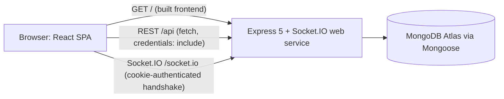
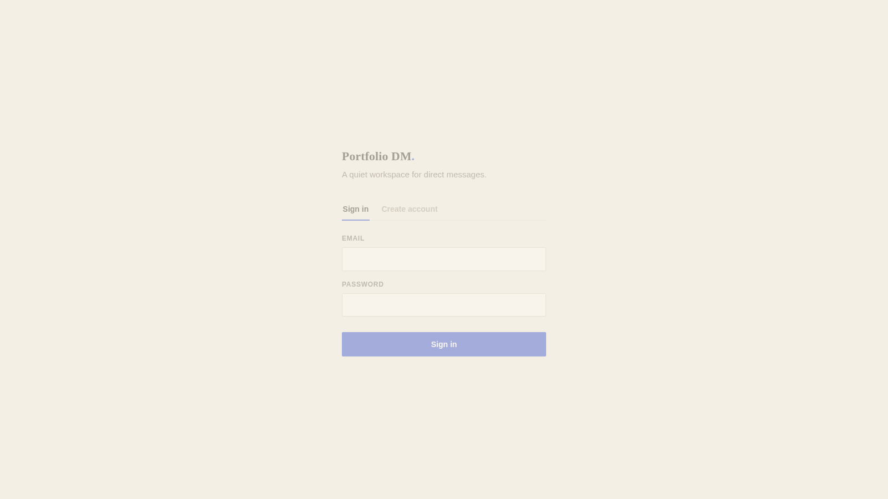
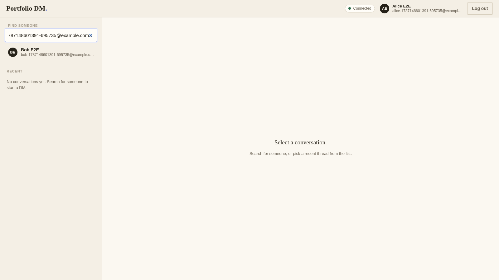
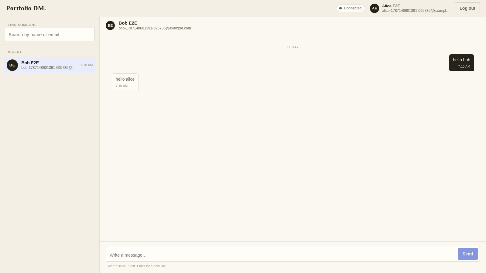
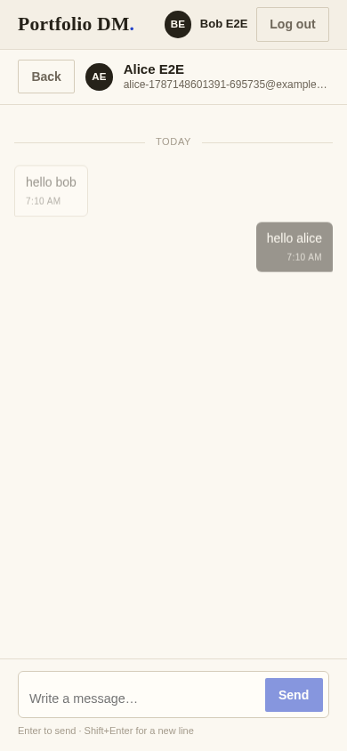

# Portfolio DM

Portfolio DM is a full-stack direct-message web app. Users sign up, complete a short profile, search for other users, and exchange messages in real time over Socket.IO while a persisted MongoDB history keeps every conversation intact across refreshes and reconnects. The frontend and backend are separate TypeScript codebases that ship together as one same-origin production service.

## Live Demo

**Live Demo:** [https://portfolio-dm-lennytheworm12.onrender.com](https://portfolio-dm-lennytheworm12.onrender.com)

The Render Blueprint in this repository defines the service; deployment activation is pending verification, so the first public visit may land before the initial deploy finishes. The service runs on Render's free tier, which cold-starts on the first request after an idle period.

## Features

- **Cookie-based accounts** — signup, login, and logout with a seven-day JWT session that survives page refreshes.
- **Profile completion** — set a display name and color before starting conversations.
- **User search** — find people by first name, last name, or email; the current user is always excluded.
- **Recent conversations** — a sidebar derived from message history, ordered newest first.
- **Persisted DM history** — chronological two-user message threads stored in MongoDB.
- **Live delivery** — Socket.IO pushes each message to both sender and recipient the moment it is persisted.
- **Responsive UI** — desktop and mobile layouts with visible loading, error, and reconnect states.

## Tech Stack

| Layer | Technology |
| --- | --- |
| Frontend | React 19, TypeScript, Vite, native `fetch`, socket.io-client |
| Backend | Node.js, Express 5, TypeScript, Socket.IO |
| Data | MongoDB (Atlas in production), Mongoose |
| Auth | JWT in `httpOnly` cookies, bcryptjs |
| Tests | Jest, Supertest, MongoMemoryServer |

## Architecture

One Render web service serves everything on a single origin: the built React app at `/`, the REST API under `/api`, and Socket.IO under `/socket.io`. Express 5 and the Socket.IO server share the same HTTP server and MongoDB connection, so production runs without cross-origin hops.



The repository keeps the two source layers separate: `chat-frontend` (Vite/React) and `chat-backend` (Express/Socket.IO). In production the backend serves `chat-frontend/dist` as static files, so the deployed artifact is a single service with no separate frontend host.

## Screenshots









## Local Development

Requirements: Node.js, [pnpm](https://pnpm.io/), and a MongoDB instance (local or Atlas).

**Terminal 1 — backend**

```bash
cd chat-backend
pnpm install
cp .env.example .env
```

Edit `chat-backend/.env` and provide real values: `MONGO_URL` (connection string), `JWT_SECRET` (long random value, e.g. `openssl rand -base64 48`), and `CLIENT_ORIGIN=http://localhost:5173` (the Vite dev server origin).

```bash
pnpm dev
```

**Terminal 2 — frontend**

```bash
cd chat-frontend
pnpm install
cp .env.example .env   # optional; the default backend URL already works in dev
pnpm dev
```

Open [http://localhost:5173](http://localhost:5173). In Vite development the frontend calls `http://localhost:8747` (the backend's default port) unless `VITE_API_URL` is set; production builds use the page's own origin instead.

## Environment Variables

**Backend (`chat-backend/.env`)**

| Variable | Purpose |
| --- | --- |
| `PORT` | Server port (example: `8747`) |
| `MONGO_URL` | MongoDB connection string |
| `JWT_SECRET` | Long random value used to sign session tokens |
| `CLIENT_ORIGIN` | Comma-separated exact browser origins allowed by CORS |
| `NODE_ENV` | `development` \| `test` \| `production` |

**Frontend (`chat-frontend/.env`)**

| Variable | Purpose |
| --- | --- |
| `VITE_API_URL` | Optional backend origin override; defaults to `http://localhost:8747` in dev and same-origin in production builds |

Example files are committed as `.env.example` in each directory; actual `.env` files are gitignored and never committed.

## Testing

**Backend**

```bash
cd chat-backend
pnpm test
pnpm build
```

The suite runs 120 tests across 8 Jest/Supertest suites against an in-memory MongoDB and reports 97.37% statement, 92.94% branch, 98.07% function, and 97.23% line coverage, with thresholds enforced in `jest.config.cjs`.

**Frontend**

```bash
cd chat-frontend
pnpm lint
pnpm build
```

The app was also exercised end to end with two isolated Chromium contexts (Alice and Bob) against MongoDB Atlas: signup, profile setup, search, live two-way messaging, history persistence across refresh, offline/reconnect recovery, logout-then-401, invalid-login and duplicate-signup handling, and desktop/mobile viewport checks, with no unexpected console errors. The full flow is documented in [docs/local-acceptance.md](docs/local-acceptance.md).

## Deployment

`render.yaml` defines a single Render web service, `portfolio-dm-lennytheworm12` (free plan, auto-deploy on commit):

- The build command installs and builds both layers; the start command runs `node chat-backend/dist/index.js`.
- Express serves the built React app at `/`, REST under `/api`, and Socket.IO at `/socket.io`, with `/health` for liveness checks.
- Render provides HTTPS and native WebSocket support.
- `MONGO_URL` is prompted on first deploy (kept out of the Blueprint), `JWT_SECRET` is generated and stored by Render, and `CLIENT_ORIGIN` is pinned to the service's deterministic URL.
- The MongoDB Atlas cluster must permit connections from Render's egress network.

No secrets are committed: production credentials live only in Render's environment and the Atlas cluster configuration.

## Security

- JWT lives only in an `httpOnly` cookie — never in JavaScript or `localStorage` — with a seven-day expiry; production sets `Secure; SameSite=None`, and local development uses `SameSite=Lax`.
- CORS is restricted to exact configured origins with credentials enabled; browser requests from unlisted origins are rejected.
- The Socket.IO handshake authenticates through the JWT cookie only; client-supplied identity is ignored, and the sender is always derived from the verified token server-side.
- Message input is bounded and validated: recipient must exist, content length is capped, and message type is constrained.
- Passwords are hashed with bcryptjs and stripped from every API response; invalid logins return a generic message so accounts cannot be enumerated.
- Required environment variables are validated before the server starts.

## Project Origin

Portfolio DM began as an individual CS314 software-engineering backend project and was extended into an independent, full-stack, deployable application: a repository-owned React client, hardened authentication and Socket.IO contracts, production deployment configuration, and an end-to-end acceptance flow. The former course frontend is not part of the application or deployment.

## Known Limitations

- Direct messages only — no channels, group chats, attachments, presence, typing indicators, or read receipts.
- The free-tier Render service may cold-start on the first request after an idle period.
